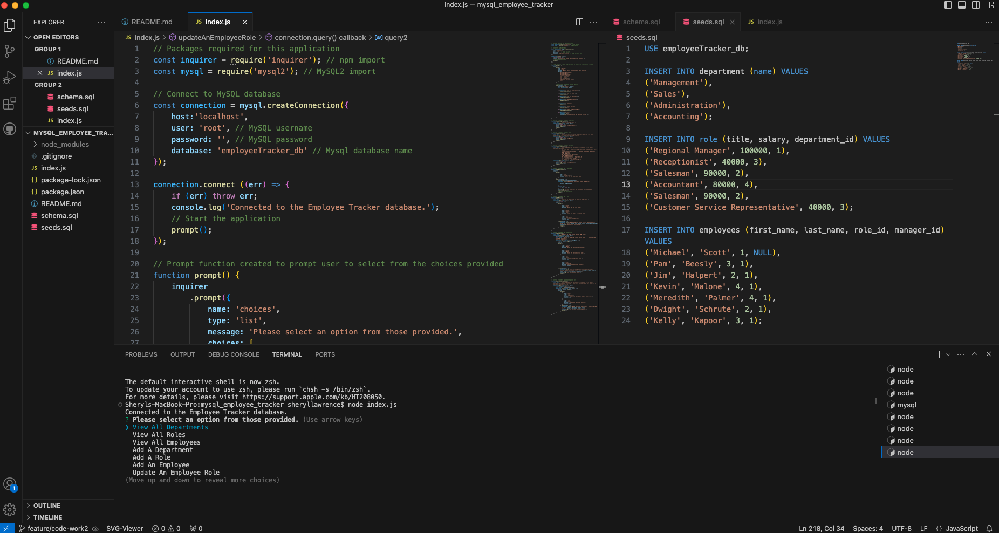

# mysql_employee_tracker
- A command-line application to manage employee database using Node.js, Inquirer, and MySQL

## Description
- The motivation for this project was to create an interface for business owners to easily view and interact with their employee information stored in a database.
- An Employee Tracker database was created so that a business owner could easily view and manage the departments, roles and employees in their company so that they could organize and plan their business. 
- Initially, there were challenges faced with the syntax in MySQL files, which were causing errors in the generation of all the tables, but they were quickly resolved. 
- There were also challenges in the index.js file when joining the tables. These were mostly syntax issues, which took a lot of trial and error to resolve. 
- There are errors in the terminal when adding a new role and employee as some of the questions presented to the users are duplicated, then showing that they are created but not appearing in the tables. 
- As well, the function to 'Update An Employee Role' is not showing any values and instead only shows undefined in the terminal. However, after going through the other options in the terminal only errors appear when the 'Update an Employee Role' option is selected. In future developlment, I would like to fix these errors in addition to adding the bonus features to this project. 
- I also underestimated the amount of time this project would take and its length. I aimed to consolidate code and keep code consistent throughout, especially in the index.js file, while solidifying my understanding and learning of the concepts, which added to my challenges with time.
- Through the making of this project I furthered my understanding of command-line applications and, especially, MySQL.
- This project utilizes Node.JS, Inquirer, specifically version 8.2.4, and MySQL2. 

## Installation
- The user can check if they have Node.JS by running the command node -v.
- If the user does not have Node.JS already installed they can go to http://nodejs.org and follow the instructions provided.
- The user can check if they have Inquirer by running the command "npm -v".
- If the user does not have Inquirer they can run the command "npm i or "npm install".
- The user can check if they my MySQL by running the command mysql and a version will appear. 
If the user does not already have MySQL installed they can go to http://dev.mysql.com and follow the instructions provided.
- Next, the user will open the MySQL Shell that connects the terminal to the MySQL instance by running the command mysql -u root -p. Then, the user will be prompted to enter their MySQL password created during installation.

## Usage
- To use this project, the user must open the intergrated terminal in a source code editor.
- Next, the user will run the command node 'index.js'.

- Video showing usage of this project in terminal to utilize Employee Tracker. 

https://drive.google.com/file/d/1oZCjpF-Hs0ztd7wntLsaPyxGBewI5KYT/view

- Screenshots showing usage of this project in terminal.

## License 
- There is no license for this project.

## Credits

Calle, T. (2023). Thomas SQL Employee Tracker. GitHub [Source Code]. https://github.com/ThomasCalle/Thomas-SQL-Employee-Tracker.git

Cuddeback, A. (2021). Employee Tracker. GitHub [Source Code]. https://github.com/ajcuddeback/EmployeeTracker.git

DopeDev. (2022, November 17). Employee Track (Tutorial) MySQL, Node, Inquirer. [Video]. YouTube. https://www.youtube.com/watch?v=OOgw_kSIc_A

Evans, R. (2021). MySQL Employee Tracker. GitHub [Source Code]. https://github.com/rdevans87/MySQL-Employee-Tracker.git

Marcelino, L. (2021). MySQL Employee Tracker. GitHub [Source Code]. https://github.com/Ethanlloyd21/MySQL-Employee-Tracker.git

Meyers, M. [2024, March 16]. Online tutoring session [Zoom].

Geeks for Geeks. (n.d.). MySQL Joins. https://www.w3schools.com/mysql/mysql_join.asp

University of Toronto. (2023). Coding Boot Camp [Source Code].